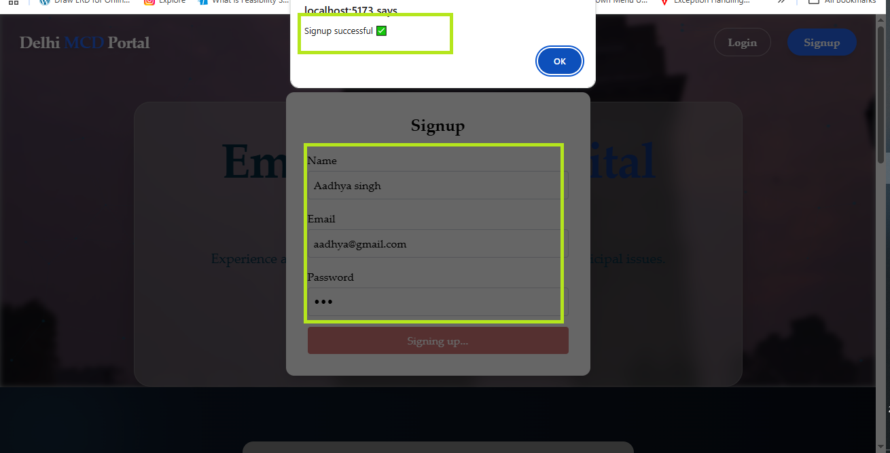
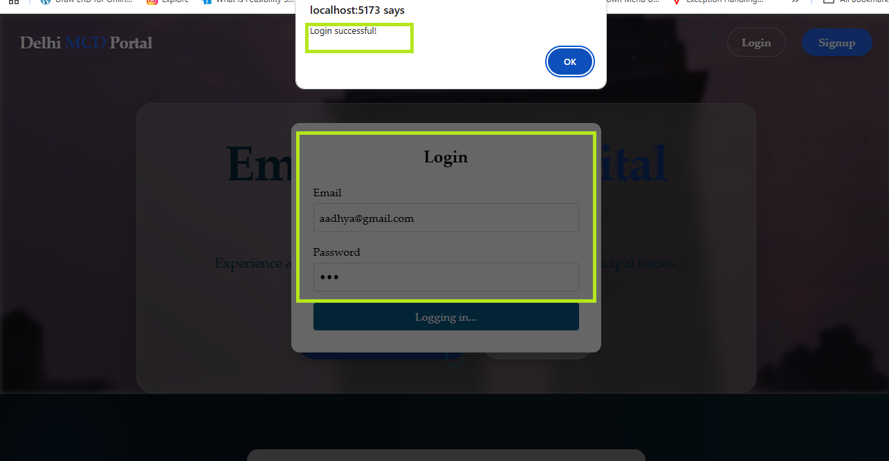

# Delhi MCD Complaint Portal

## Description
The demo link of a project https://priyanshi-ops.github.io/Delhi-MCD-Complaint-portal/. The objective of this project is to provide an online platform for citizens of Delhi to register, track, and manage complaints related to Municipal Corporation of Delhi (MCD) services such as:
-Garbage collection
-Street light issue
-Waterlogging
-Road damage
-Stray Animals
-Sewage/Drainage

## Tech Stack
- Java
- JavaScript
- Springboot
- Intellij IDE
- React js
- Rest API
- Mysql
- GitHub

##  Screenshots

---

###  Signup Page

---

###  Login Page

---

###  Data Persistence
Login information is securely captured and stored in the **`user`** table within the **`auth_db`** MySQL database, maintaining data integrity and accessibility for authentication purposes.

---

###  Smart Form Pre-filling
Upon successful authentication, the user's credentials — including username and email address — are automatically retrieved from the session and dynamically populated into the Complaint Form, ensuring a flawless and efficient user experience.

---

###  Complaint Submission & Persistence
Complaint form submissions are securely persisted to the **`complaints`** table within the **`auth_db`** MySQL database, ensuring reliable data storage and traceability.

## How to Run
1. Clone the repo
2. Open in IntelliJ
3. Run the main class
